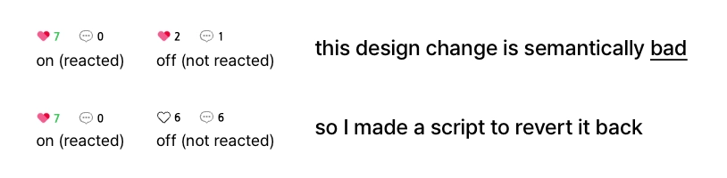

## Revert Naver Blog Reaction Button

### 설치 방법

1. UserScript 매니저 설치

- Chrome : [TamperMonkey](https://chromewebstore.google.com/detail/tampermonkey/dhdgffkkebhmkfjojejmpbldmpobfkfo)
- Edge : [ViolentMonkey](https://microsoftedge.microsoft.com/addons/detail/violentmonkey/eeagobfjdenkkddmbclomhiblgggliao)
- Firefox : [ViolentMonkey](https://addons.mozilla.org/ko/firefox/addon/violentmonkey/)
- Safari : [Userscripts](https://apps.apple.com/us/app/userscripts/id1463298887)

2. 스크립트 설치

- [스크립트 다운로드 링크](https://raw.githubusercontent.com/potatosalad775/revertNBlogReactionBtn/main/revertNBlogReactionBtn.user.js)